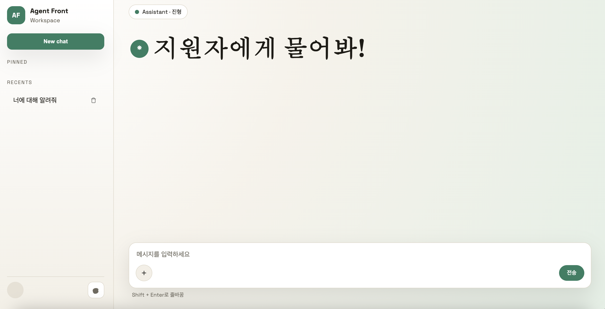

# 지원자에게 무엇이든 물어봐! (진행중)

## 사이트: https://d2lqi33nqmhm1k.cloudfront.net

## 소개

> openai api, openai agents sdk를 활용한 ai서비스를 구현했습니다.
>
> 이 웹사이트는 채팅 UI로 구현되어 있고, 에이전트에 채팅을 걸면 stream 방식으로 답변을 내려주는 기능이 구현되어 있습니다.
>
> 프론트엔드는 html, scss, typescript로 구성된 일반적인 ssg 방식의 프로젝트 형태를 띄고 있고, 번들링 라이브러리로는 parcel을 선택했습니다.
>
> 간단한 UI이지만, 아키텍처 적용 학습을 위해 feature-sliced-design (FSD) 패턴을 적용한 프로젝트 구조를 설계 했습니다.
>
> 백엔드는 fastapi와 openai 라이브러리로 구현했습니다.
> 백엔드 구조는 클린 아키텍처를 적용 했습니다.
>
> 백엔드 repo: https://github.com/bibibush/AgentOps

## 사용 기술

- html, css, typescript
- parcel
- s3, cloudFront

## 프로젝트 구조

```
.
├─ src/
│  ├─ index.html            # 앱 마크업
│  ├─ styles/
│  │  └─ main.scss          # 전역 스타일
│  └─ scripts/
│     ├─ main.ts            # 엔트리, UI 이벤트 바인딩, 세션/채팅 초기화
│     ├─ share/
│     │  ├─ api.ts          # 공통 API 요청/스트리밍 유틸 + snake/camel 변환
│     │  ├─ hooks.ts        # 사이드바 토글, composer 리사이즈 훅
│     │  ├─ markdown.ts     # 마크다운 렌더링
│     │  ├─ state.ts        # 클로저 기반 전역 상태 관리
│     │  ├─ type.ts         # 공통 응답 타입 (ResponseAPI, SSEEvent)
│     │  └─ var.ts          # 공통 상수
│     └─ features/
│        ├─ ai-chat/
│        │  ├─ index.ts     # 전송 이벤트 연결
│        │  ├─ hook.ts      # 메시지 전송 흐름(일반/SSE)
│        │  ├─ api.ts       # AI 응답 API 호출
│        │  ├─ ui.ts        # 채팅 UI 렌더링/스트리밍 표시
│        │  └─ type.ts      # AI 요청 타입 정의
│        └─ session/
│           ├─ index.ts     # 세션 초기화 (유저 조회, 리스너 등록)
│           ├─ hook.ts      # 세션 목록 렌더링
│           ├─ api.ts       # 세션/유저 API 호출
│           ├─ ui.ts        # 세션 아이템/메시지 렌더링
│           └─ type.ts      # 세션 관련 타입 정의
└─ package.json
```

## 사용 방법



채팅 입력창에 지원자에게 궁금한 내용을 자연스럽게 질문하면 됩니다.

## 핵심 로직

<details>
  <summary><b>textArea 높이 자동 조절</b></summary>

### 입력 내용에 맞춰 textArea 높이를 자동 확장

`src/scripts/main.ts`에서 입력 이벤트를 감지해 높이를 갱신합니다.
입력 시 높이를 `"auto"`로 리셋한 뒤 `scrollHeight` 기준으로 확장하며,
최대 높이는 200px로 제한합니다.

```ts
const composer = document.querySelector<HTMLTextAreaElement>("[data-composer]");

const resizeComposer = () => {
  if (!composer) return;
  composer.style.height = "auto";
  const nextHeight = Math.min(composer.scrollHeight, 200);
  composer.style.height = `${nextHeight}px`;
};

composer?.addEventListener("input", resizeComposer);
window.addEventListener("load", resizeComposer);
```

</details>
<br />
<details>
  <summary><b>FSD 패턴 적용</b></summary>

### 1) FSD 패턴: 공통 로직과 채팅 로직 분리

- `src/scripts/share`: 전역 비즈니스 로직(공통 타입/요청/상수)
- `src/scripts/features/ai-chat`: 채팅 도메인 로직(API 호출, UI 렌더링)

### 2) 공통 요청 유틸 (camelCase ↔ snake_case)

`src/scripts/share/api.ts` 에서 요청은 `snake_case`, 응답은 `camelCase` 로 자동 변환하도록 fetch 를 감쌉니다.

```ts
export const requestAPI = async <T>(
  url: string,
  { method = "GET", params, body, headers }: RequestApiOptions = {},
): Promise<T> => {
  const requestUrl = new URL(url, window.location.origin);

  if (params) {
    const snakeParams = _camelToSnakeDeep(params) as JsonObject;
    Object.entries(snakeParams).forEach(([key, value]) => {
      requestUrl.searchParams.set(key, String(value));
    });
  }

  const hasBody = body !== undefined && body !== null;
  const requestBody = hasBody
    ? JSON.stringify(_camelToSnakeDeep(body))
    : undefined;

  const response = await fetch(requestUrl.toString(), {
    method,
    headers,
    body: requestBody,
  });

  const data = (await response.json()) as T;
  return _snakeToCamelDeep(data);
};
```

### 3) 채팅 도메인 API 호출

`src/scripts/features/ai-chat/api.ts` 에서는 위 공통 요청 유틸을 가져와 실제 요청 함수를 구성합니다.

```ts
import { requestAPI, requestStreamingAPI } from "../../share/api";
import { ResponseAPI, SSEEvent } from "../../share/type";
import { OpenAIResponseAPIModel } from "./type";
import { OPENAI_RESPONSE_PREFIX, HOST } from "../../share/var";

export async function getOpenaiResponse(data: OpenAIResponseAPIModel) {
  try {
    const response = await requestAPI<ResponseAPI<string>>(
      `https://${HOST}/${OPENAI_RESPONSE_PREFIX}/text`,
      { method: "POST", body: data },
    );
    return response;
  } catch (error) {
    return Promise.reject(error);
  }
}

export async function* getOpenaiResponseSSE(
  data: OpenAIResponseAPIModel,
): AsyncGenerator<SSEEvent> {
  try {
    const stream = requestStreamingAPI(
      `https://${HOST}/${OPENAI_RESPONSE_PREFIX}/sse`,
      { method: "POST", body: data },
    );

    for await (const event of stream) {
      yield event;
    }
  } catch (error) {
    throw error;
  }
}
```

### 4) 동적 채팅 UI 관리

`src/scripts/features/ai-chat/ui.ts` 에서 사용자/AI 메시지를 DOM 으로 생성하고,
스트리밍 응답은 동일한 엘리먼트를 갱신합니다.

```ts
export const sendMessageUI = () => {
  const composer =
    document.querySelector<HTMLTextAreaElement>("[data-composer]");
  const messagesContainer = document.querySelector(".messages");

  const text = composer?.value.trim();
  if (!text || !messagesContainer || !composer) return;

  const message = document.createElement("article");
  message.className = "message user";
  message.innerHTML = `
    <div class="message-meta">
      <span class="badge">나</span>
    </div>
    <div class="message-body">
      <p style="white-space: pre-wrap;">${text}</p>
    </div>
  `;

  messagesContainer.appendChild(message);
  message.scrollIntoView({ behavior: "smooth" });

  composer.value = "";
  composer.style.height = "auto";
};

export const receiveMessageSSE = (text: string, done = false) => {
  const messagesContainer = document.querySelector(".messages");
  if (!messagesContainer) return;

  let message = messagesContainer.querySelector<HTMLElement>(
    "[data-ai-streaming='true']",
  );

  if (!message) {
    message = document.createElement("article");
    message.className = "message assistant";
    message.dataset.aiStreaming = "true";
    message.innerHTML = `
      <div class="message-meta">
        <span class="badge">AI</span>
      </div>
      <div class="message-body"></div>
    `;

    messagesContainer.appendChild(message);
  }

  // 마크다운 렌더링 적용
  const body = message.querySelector(".message-body");
  if (body) {
    body.innerHTML = renderMarkdown(text);
  }

  if (done) {
    delete message.dataset.aiStreaming;
  }

  message.scrollIntoView({ behavior: "smooth" });
};
```

### 5) 타입 정의 분리

- `src/scripts/share/type.ts`: 백엔드 응답에 대한 공통 데이터 모델
- `src/scripts/features/ai-chat/type.ts`: OpenAI 요청에 필요한 데이터 모델

```ts
// src/scripts/share/type.ts
export interface ResponseAPI<T> {
  statusCode: number;
  message: string;
  data: T;
}

export type SSEEvent =
  | { type: "session"; data: string }
  | { type: "data"; data: string };
```

```ts
// src/scripts/features/ai-chat/type.ts
export interface OpenAIResponseAPIModel {
  model: string;
  input: Array<Record<string, unknown>> | string;
  instructions?: string;
  sessionId: number | null;
  stream?: boolean;
  tools?: OpenAIToolsModel[];
}
```

</details>
<br />
<details>
  <summary><b>스트리밍 응답 구현</b></summary>

### 스트리밍 응답 구현

`src/scripts/share/api.ts` 의 `requestStreamingAPI` 는 FastAPI SSE 응답을
`event:`/`data:` 필드 단위로 파싱해 `SSEEvent` 타입의 `AsyncGenerator` 로 전달합니다.
`\r\n`, `\r` 개행을 `\n`으로 정규화하고, 멀티라인 `data:` 필드도 지원합니다.

```ts
export const requestStreamingAPI = async function* (
  url: string,
  { method = "POST", params, body, headers }: RequestApiOptions = {},
): AsyncGenerator<SSEEvent> {
  // ... fetch 요청 생략 ...

  const reader = response.body?.getReader();
  const decoder = new TextDecoder();

  if (!reader) {
    throw new Error("Response body is null");
  }

  let buffer = "";
  let currentEventType: SSEEvent["type"] = "data";
  let currentDataLines: string[] = [];

  while (true) {
    const { done, value } = await reader.read();
    if (done) break;

    buffer += decoder.decode(value, { stream: true });
    const normalized = buffer.replace(/\r\n/g, "\n").replace(/\r/g, "\n");
    const lines = normalized.split("\n");
    buffer = lines.pop() || "";

    for (const line of lines) {
      if (line === "") {
        if (currentDataLines.length > 0) {
          const data = currentDataLines.join("\n");
          yield { type: currentEventType, data };
        }
        currentEventType = "data";
        currentDataLines = [];
        continue;
      }

      if (line.startsWith("event:")) {
        const eventType = line.slice(6).trim();
        currentEventType = eventType === "session" ? "session" : "data";
        continue;
      }

      if (line.startsWith("data:")) {
        const data = line.slice(5).trimStart();
        currentDataLines.push(data);
      }
    }
  }
};
```

이 함수는 `src/scripts/features/ai-chat/api.ts` 의 SSE 호출에서 사용되며,
`SSEEvent` 타입으로 이벤트를 전달합니다.

```ts
export async function* getOpenaiResponseSSE(
  data: OpenAIResponseAPIModel,
): AsyncGenerator<SSEEvent> {
  try {
    const stream = requestStreamingAPI(
      `https://${HOST}/${OPENAI_RESPONSE_PREFIX}/sse`,
      { method: "POST", body: data },
    );

    for await (const event of stream) {
      yield event;
    }
  } catch (error) {
    throw error;
  }
}
```

`src/scripts/features/ai-chat/hook.ts` 에서 스트리밍 결과를 받아 `event.type`에 따라
세션 ID 설정 또는 UI 갱신을 분기 처리합니다.
새 세션인 경우 스트리밍 완료 후 사이드바 세션 목록도 갱신합니다.

```ts
const sessionId = getCurrentSessionId();
const isNewSession = sessionId === null;

const stream = getOpenaiResponseSSE({
  model: "gpt-5.2",
  input: text,
  stream: true,
  sessionId,
});

let aiResponse = "";

for await (const event of stream) {
  if (event.type === "session") {
    setCurrentSessionId(Number(event.data));
  } else {
    aiResponse += event.data;
    receiveMessageSSE(aiResponse);
  }
}

receiveMessageSSE(aiResponse, true);
if (isNewSession) {
  // 사이드바 세션 목록 갱신
  await renderSessions(user.id, sessionContainer);
}
```

</details>
<br />
<details>
  <summary><b>DOMPurify 기반 XSS 방지</b></summary>

### 마크다운 렌더링 시 XSS 공격 차단

`src/scripts/share/markdown.ts` 에서 `marked`로 변환된 HTML을 `DOMPurify`로 새니타이징하여
스크립트/이벤트 핸들러 삽입을 차단합니다. 허용 태그/속성을 제한하고, 오류 시에는
원본 텍스트를 이스케이프 처리해 안전하게 렌더링합니다.

```ts
const rawHtml = marked.parse(markdown) as string;

const safeHtml = DOMPurify.sanitize(rawHtml, {
  ALLOWED_TAGS: [
    "p", "br", "strong", "em", "u", "s", "del",
    "h1", "h2", "h3", "h4", "h5", "h6",
    "ul", "ol", "li", "blockquote",
    "pre", "code", "a", "hr",
    "table", "thead", "tbody", "tr", "th", "td",
  ],
  ALLOWED_ATTR: ["href", "src", "alt", "title", "class"],
  ALLOW_DATA_ATTR: false,
});
```

</details>
<br />
<details>
  <summary><b>사이드바와 과거 대화 내용 불러오기</b></summary>

### 사이드바와 과거 대화 내용 불러오기

사이드바에 세션 목록을 렌더링하고, 세션을 클릭하면 과거 대화 내용을 불러오는 기능입니다.
클로저 기반 상태 관리와 리스너 패턴을 활용해 상태 변경 시 UI가 자동으로 갱신됩니다.

### 1) 클로저 기반 상태 관리

`src/scripts/share/state.ts` 에서 IIFE 클로저로 전역 상태를 관리합니다.
`setMessages()` 호출 시 등록된 리스너들이 실행되어 UI가 자동 갱신됩니다.

```ts
const stateManager = (() => {
  let currentSessionId: number | null = null;
  let messages: ChatMessage[] = [];
  let user: User | null = null;
  const messagesListeners: Array<(messages: ChatMessage[]) => void> = [];

  return {
    getCurrentSessionId: () => currentSessionId,
    setCurrentSessionId: (sessionId: number | null) => {
      currentSessionId = sessionId;
    },
    getMessages: () => messages,
    setMessages: (newMessages: ChatMessage[]) => {
      messages = newMessages;
      messagesListeners.forEach((listener) => listener(messages));
    },
    getUserState: () => user,
    setUser: (newUser: User | null) => {
      user = newUser;
    },
    addMessagesListener: (listener: (messages: ChatMessage[]) => void) => {
      messagesListeners.push(listener);
    },
    removeMessagesListener: (listener: (messages: ChatMessage[]) => void) => {
      const index = messagesListeners.indexOf(listener);
      if (index > -1) {
        messagesListeners.splice(index, 1);
      }
    },
  };
})();
```

### 2) 세션 초기화 흐름

`src/scripts/features/session/index.ts` 의 `initSession()` 에서 앱 시작 시
유저 정보 조회 → 메시지 리스너 등록 → 세션 목록 렌더링 → New Chat 버튼 바인딩을 순차적으로 수행합니다.

```ts
export async function initSession(container: HTMLElement) {
  const response = await getUser();

  if (!response.data) {
    return;
  }

  const user = response.data;
  setUser(user);

  // 메시지 변경 감지 리스너 등록
  const messagesContainer = document.querySelector<HTMLElement>(".messages");
  if (messagesContainer) {
    addMessagesListener(() => {
      const messages = getMessages();
      renderMessages(messages, messagesContainer);
    });
  }

  await renderSessions(user.id, container);

  // New chat 버튼 이벤트 추가
  const newChatButton = document.querySelector(".new-chat");
  if (newChatButton) {
    newChatButton.addEventListener("click", () => {
      setCurrentSessionId(null);
      setMessages([]);
    });
  }
}
```

### 3) 세션 목록 렌더링과 클릭 이벤트

`src/scripts/features/session/hook.ts` 의 `renderSessions()` 는 API로 세션 목록을 조회한 뒤,
각 세션 아이템에 **클릭 시 `setMessages()`** 를 호출하는 핸들러를 연결합니다.
이로 인해 리스너가 발동되어 `renderMessages()` 로 과거 대화 내용이 화면에 렌더링됩니다.

```ts
export async function renderSessions(userId: number, container: HTMLElement) {
  const response = await getSessions(userId);

  if (!response.data) {
    return;
  }

  const sessions = response.data;
  container.innerHTML = "";

  sessions.forEach((session) => {
    const sessionItem = createSessionItem({
      title: session.title ?? "새 대화",
      sessionId: session.id,
      onClick: () => {
        setMessages(session.messages);
      },
      onDeleteSuccess: () => {
        renderSessions(userId, container);
      },
    });
    container.appendChild(sessionItem);
  });
}
```

### 4) 과거 메시지 렌더링

`src/scripts/features/session/ui.ts` 의 `renderMessages()` 는 `DocumentFragment` 를 사용해
리플로우를 최소화하면서 메시지를 일괄 렌더링합니다.
role에 따라 사용자/AI 메시지를 구분하고, AI 응답에는 마크다운 렌더링을 적용합니다.

```ts
function createMessageElement(message: ChatMessage): HTMLElement {
  const article = document.createElement("article");

  if (message.role === "user") {
    article.className = "message user";
    article.innerHTML = `
      <div class="message-meta">
        <span class="badge">나</span>
      </div>
      <div class="message-body">
        <p style="white-space: pre-wrap;">${escapeHtml(message.message)}</p>
      </div>
    `;
  } else if (message.role === "assistant") {
    article.className = "message assistant";
    article.innerHTML = `
      <div class="message-meta">
        <span class="badge">AI</span>
      </div>
      <div class="message-body"></div>
    `;

    // 마크다운 렌더링 적용
    const messageBody = article.querySelector(".message-body");
    if (messageBody) {
      messageBody.innerHTML = renderMarkdown(message.message);
    }
  }

  return article;
}

export function renderMessages(
  messages: ChatMessage[],
  container: HTMLElement,
): void {
  if (!messages || messages.length === 0) {
    container.innerHTML = "";
    return;
  }

  // DocumentFragment 사용으로 리플로우 최소화
  const fragment = document.createDocumentFragment();

  messages.forEach((message) => {
    const messageElement = createMessageElement(message);
    fragment.appendChild(messageElement);
  });

  // 한 번에 DOM에 추가
  container.innerHTML = "";
  container.appendChild(fragment);

  // 마지막 메시지로 부드럽게 스크롤
  const lastMessage = container.lastElementChild;
  if (lastMessage) {
    lastMessage.scrollIntoView({ behavior: "smooth", block: "nearest" });
  }
}
```

### 5) 전체 데이터 흐름

```
앱 로드 → initSession()
  ↓
getUser() API 호출 → setUser(user)
  ↓
addMessagesListener() 등록 (messages 변경 시 renderMessages 실행)
  ↓
renderSessions() → getSessions(userId) API 호출
  ↓
세션 목록을 사이드바에 렌더링 (createSessionItem)
  ↓
사용자가 세션 클릭 → setMessages(session.messages)
  ↓
리스너 발동 → renderMessages() → 과거 대화 내용 표시
  ↓
"New Chat" 버튼 클릭 → setCurrentSessionId(null) + setMessages([]) → 화면 초기화
```

### 6) 세션 삭제

`src/scripts/features/session/ui.ts` 의 `createSessionItem()` 에서 각 세션 아이템에
삭제 버튼을 포함하며, 삭제 성공 시 `onDeleteSuccess` 콜백으로 세션 목록을 다시 렌더링합니다.

```ts
deleteButton.addEventListener("click", async (e) => {
  e.stopPropagation();
  try {
    await deleteSession(sessionId);
    onDeleteSuccess?.();
  } catch (error) {
    console.error("Failed to delete session:", error);
  }
});
```

### 7) 타입 정의

`src/scripts/features/session/type.ts` 에서 세션 관련 데이터 모델을 정의합니다.

```ts
export interface ChatMessage {
  id: number;
  role: string;
  message: string;
  sessionId: number;
  createdAt: string;
}

export interface Session {
  id: number;
  title?: string;
  messages: ChatMessage[];
}

export interface User {
  id: number;
  username: string;
  email: string;
  sessions: Session[];
}
```

</details>

## 개선 사항 (진행중)

> 아직 프로젝트 진행중이며, 아래 항목은 다음 단계에서 개선할 예정입니다.

- 이미지 및 툴 사용 기능 추가
